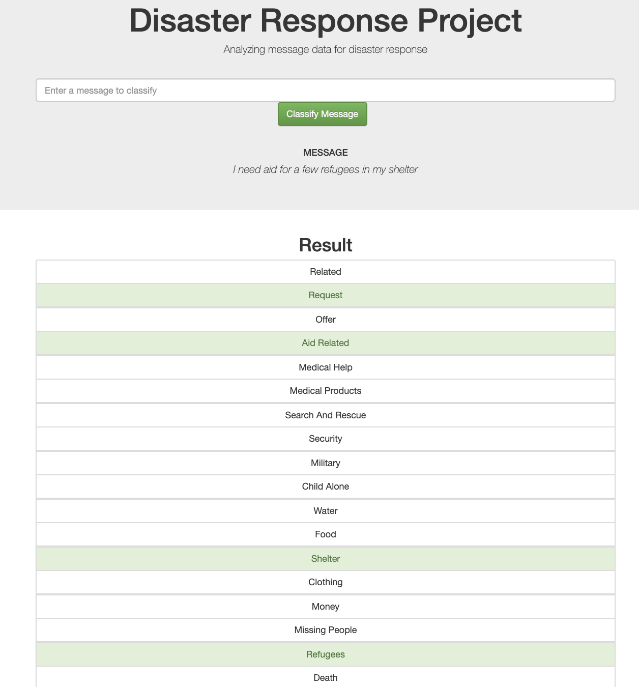

# Disaster Response Pipeline Project

This project uses the Figure Eight dataset which includes pre-labelled tweets and messages from real-life disasters. The goal is to build a Natural Language Processing pipeline that can categorize messages.

The Project is divided in the following Sections:

1. The first part of the data pipeline is the Extract, Transform, and Load process -  read the dataset, clean the data, and then store it in a SQLite database (See data/process_data.py). You can see the detailed steps in data/ETL Pipeline Preparation.ipynb
2. Next, the data is split into training set and a test set. Then, machine learning pipeline is created that uses NLTK, as well as scikit-learn's Pipeline and GridSearchCV to output a model that uses the message column to predict classifications for 36 categories (multi-output classification). Finally, the model will be exported to a pickle file (see models/train_classifier.py).You can see the detailed steps in models/ML Pipeline Preparation.ipynb
3. Lastly, the results will be shown in a Flask web app (see app/run.py)

### Instructions:
1. Run the following commands in the project's root directory to set up your database and model.

    - To run ETL pipeline that cleans data and stores in database
        `python data/process_data.py data/disaster_messages.csv data/disaster_categories.csv data/DisasterResponse.db`
    - To run ML pipeline that trains classifier and saves
        `python models/train_classifier.py data/DisasterResponse.db models/classifier.pkl`

2. Run the following command in the app's directory to run your web app.
    `python run.py`

3. Go to http://0.0.0.0:3003/

References:

This project has been completed as a part of Udacity Data Science Nanodegree.

The code has been inspired by 2 other Github repositories.

https://github.com/canaveensetia/udacity-disaster-response-pipeline
https://github.com/matteobonanomi/dsnd-disaster-response
